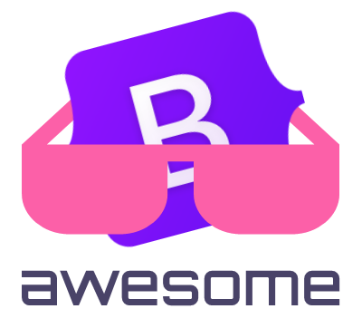

   
  
   
   

## Awesome Bootstrap 

> A curated list of awesome things related to Bootstrap 4

- [Resources](#resources)
  - [Official Resources](#official-resources)
  - [External Resources](#external-resources)
  - [Community](#community)
  - [Dev Tools](#dev-tools)
- [Components & Libraries](#components--libraries)
  - [UI Components](#ui-components)
  - [Libraries](#libraries)
- [Templates & Themes](#templates--themes)
  - [Marketplaces](#marketplaces)
  - [UI Kits](#ui-kits)
  - [Themes](#themes)
  - [WordPress](#wordpress)

## Resources

### Official Resources

> Projects created and maintained by Bootstrap's creators

- [Website](https://getbootstrap.com/)
- [Docs](https://getbootstrap.com/docs/)
- [Blog](https://blog.getbootstrap.com/)
- [Icons](https://icons.getbootstrap.com/)
- [Expo](https://expo.getbootstrap.com/)
- [Themes](https://themes.getbootstrap.com/)

### External Resources

> Popular external resources for Bootstrap

- [Wikipedia](https://en.wikipedia.org/wiki/Bootstrap_(front-end_framework))
- [W3Schools](https://www.w3schools.com/bootstrap4/default.asp)

### Community

> Stay up to date on the development of Bootstrap and reach out to the community

- [GitHub](https://github.com/twbs/bootstrap)
- [Twitter](https://twitter.com/getbootstrap)
- [Slack](https://bootstrap-slack.herokuapp.com/)

### Dev Tools

> Helpful tools for developers to use while developing with Bootstrap

- [Bootlint](https://github.com/twbs/bootlint) - HTML linter for Bootstrap projects
- [Bootstrap CDN](https://www.bootstrapcdn.com/) - The recommended CDN for Bootstrap, Font Awesome, and Bootswatch
- [Bootstrap Loader](https://github.com/shakacode/bootstrap-loader) - Load Bootstrap styles and scripts in your Webpack bundle
- [Bootstrap Studio](https://bootstrapstudio.io/) - A powerful desktop app for creating responsive websites using the Bootstrap framework
- [Pingendo](https://pingendo.com/) - Design, build and deploy websites with a modern, powerful tool

## Components & Libraries

### UI Components

> Third-party UI Components for Bootstrap

- [Bootstrap Select Dropdown](https://thompsonsj.com/bootstrap-select-dropdown/) - A jQuery plugin for Bootstrap 4 that converts select and multiselect elements to dropdowns
- [DataTables for Bootstrap](https://datatables.net/examples/styling/bootstrap4.html) - Bootstrap 4 extension for DataTables plugin
- [FormValidation](https://formvalidation.io/guide/plugins/bootstrap) - Bootstrap 4 plugin for FormValidation
- [Tempus Dominus](https://tempusdominus.github.io/bootstrap-4/) - Date Time Picker for Bootstrap 4

### Libraries

> Bootstrap components rewritten to integrate with the popular front-end frameworks

- [reactstrap](https://reactstrap.github.io/) - Easy to use React Bootstrap 4 components compatible with React
- [React Bootstrap](https://react-bootstrap.github.io/) - The most popular front-end framework Rebuilt for React
- [BootstrapVue](https://bootstrap-vue.org/) - Quickly integrate Bootstrap v4 components with Vue.js
- [NG Bootstrap](https://ng-bootstrap.github.io/) - Angular powered Bootstrap widgets

## Templates & Themes

### Marketplaces

> Third-party marketplace websites for Bootstrap based products

- [Wrapbootstrap](https://wrapbootstrap.com/) - Marketplace for premium Bootstrap-based templates
- [BootstrapBay](https://bootstrapbay.com/) - Bootstrap themes & templates for your next web project

### UI Kits

> Open source UI Kits based on Bootstrap

- [Bootswatch](https://bootswatch.com/) - Bootswatch is a collection of open source themes for Bootstrap
- [TODC Bootstrap](https://todc.github.io/todc-bootstrap/) - Open source Google styled theme for Bootstrap
- [Material Kit](https://github.com/creativetimofficial/material-kit) - Open Source UI Kit for Bootstrap by Creative Tim

### Themes

> Open source Themes & Templates based on Bootstrap

- [AdminKit](https://adminkit.io/) - Open source Web UI Kit & Dashboard Template based on Bootstrap
- [Tabler](https://tabler.io/) - Open source dashboard template with responsive and high quality UI based on Bootstrap
- [Material Dashboard](https://www.creative-tim.com/product/material-dashboard) - Material Bootstrap 4 Admin template by Creative Tim
- [Argon Dashboard](https://www.creative-tim.com/product/argon-dashboard) - Dashboard for Bootstrap 4 by Creative Tim
- [Argon Design System](https://github.com/creativetimofficial/argon-design-system) - Design System for Bootstrap 4 by Creative Tim
- [AdminLTE](https://adminlte.io/) - Open source dashboard & control panel theme based on Bootstrap
- [CoreUI](https://coreui.io/) - Free Bootstrap Admin Template

### WordPress

> Bootstrap starter templates & boilerplates for WordPress

- [UnderStrap](https://understrap.com/) - The UnderStrap package allows you to quickly and easily build SEO websites with WordPress
- [Sage](https://roots.io/sage/) - WordPress starter theme with a modern development workflow
- [Bootplate](http://bootplate.jdmdigital.co/) - Wicked-fast, mobile-first Bootstrap 4 theme framework for building awesome WordPress websites